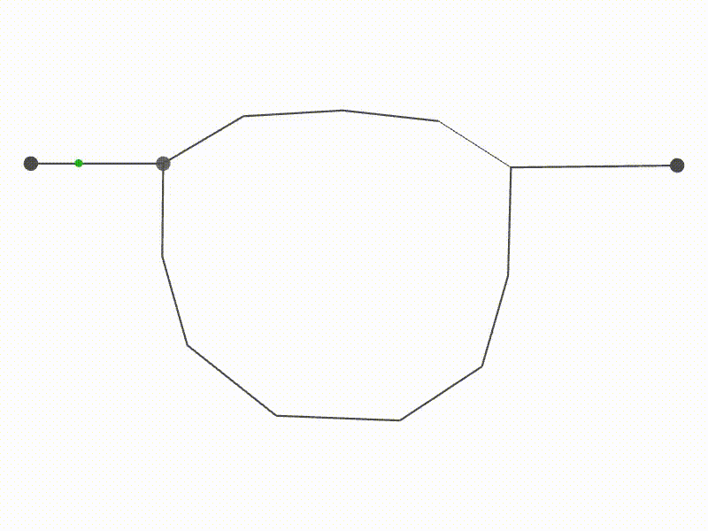

# CrowdWalkGym
API for reinforcement learning, and crowd movement simulation environments.
CrowdWalk, a multi-agent pedestrian flow simulator, is used for representing crowd movements.

# Environments
|           |  |
| ----------------------------------------- | ------------------------------------- |
| Two routes | Real map (moji port) |

